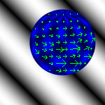

## Présentation du problème

Dans ce BE nous allons nous intéresser au problème de la détermination du mouvement à partir des images d'une vidéo. Une vidéo est en général la restitution planaire i.e. 2D d'une scène 3D et le mouvement réel en trois dimensions n'est en pratique pas déterminable à partir de ces données 2D uniquement. Ce que l'on perçoit dans une vidéo est le mouvement apparent, ce que l'on nomme le flux optique. Dans ce BE on pourra utiliser les données tests fournis par le site du Middlebury College et son équipe recherche en vision assitée par ordinateur. On trouvera cette base de donnée sur la page : [https://vision.middlebury.edu/flow/data/].

{fig-align="center" width="40%"}

## Sujet complet

Le développement complet des hypothèses, le formalisme et les questions intermédiaires sont disponibles dans le document ci-dessous :

[📄 Télécharger / Consulter le sujet au format PDF](sujets_BE/Ma223_BE_2024.pdf)

## Prérequis 

Bases du calcul différentiel, moindres carrés, méthodes itératives matricielles (Jacobi, Relaxation).  