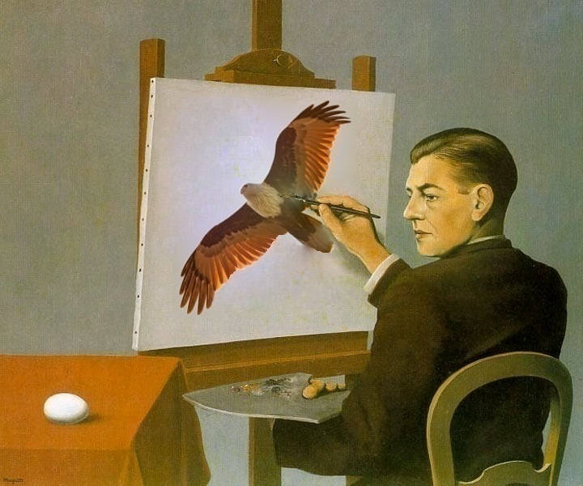

## Présentation du problème

Dans ce BE nous allons étendre/généraliser deux notions étudiées dans ce module : les équations d'Euler-Lagrange et l'algorithme du gradient conjugué à l'espace vectoriel des matrices directement. Ces deux points feront l'objet des deux premières parties et peuvent être traités de manière globalement séparées. Enfin dans une troisième et dernière partie nous utiliserons les résultats des deux premières parties afin d'obtenir des algorithmes efficaces pour résoudre des problèmes en électrostatique et dans un second temps nous utiliserons ces mêmes équations (à des variations près) afin de réaliser du traitement d'image. Ces dernières équations font bien entendu sens en physique (électrostatique, gravitation, etc...) mais les contextes physiques s'y rapportant étant assez long et complexe à introduire nous avons fait le choix du « visuel » rapide à introduire et de l'application de ces équations au traitement d'image. L'application finale de ce projet est la réalisation d'inpainting contraint. 

{fig-align="center" width="75%"}

## Sujet complet

Le développement complet des hypothèses, le formalisme et les questions intermédiaires sont disponibles dans le document ci-dessous :

[📄 Télécharger / Consulter le sujet au format PDF](sujets_BE/Ma316_BE_2024.pdf)

## Prérequis 

Bases du calcul différentiel et de l'analyse convexe, forme quadratique, gradiant conjugué.