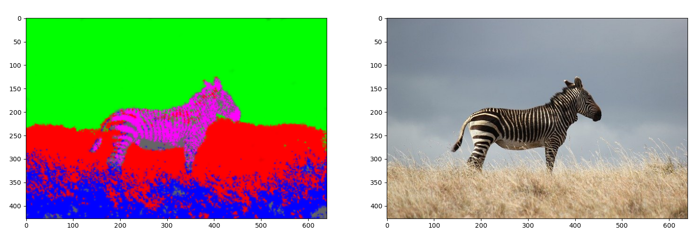

## Présentation du problème

Le but principal de ce BE est de créer un algorithme de partitionnement ou segmentation d'image (clustering) qui consistera dans ses grandes lignes à : 

1. choisir des points au hasard sur une image : position i,j en lignes et colonnes sur l'image.

2. Pour chaque pixel (i,j) on associera un vecteur (ligne) contenant la position i,j ainsi que l'intensité des trois couches de couleurs mais également d'autres paramètres que vous définirez par la suite. 

3. L'étape précédente permet de créer une matrice où chaque ligne représente les pixels choisis. On réalisera ensuite une réduction en dimension 2 sur ce tableau soit par une ACP classique ou par un auto-encodeur. On obtient une représentation 2D des pixels considérés avec leurs attributs (positions, couleurs, etc...). 

4. Utiliser l'algorithme des k-moyennes pour créer des catégories/partitions entre les pixels. On associera à chaque catégorie une couleur afin de créer un « masque ponctuel » sur l'image.

5. On utilisera enfin un algorithme d'inpainting. Cet algorithme permettra de donner une couleur de catégorie à tous les pixels de l'image (et non uniquement aux pixels choisis initialement). On crée ainsi des masques sur l'image totale. 

{fig-align="center" width="75%"}

## Sujet complet

Le développement complet des hypothèses, le formalisme et les questions intermédiaires sont disponibles dans le document ci-dessous :

[📄 Télécharger / Consulter le sujet au format PDF](sujets_BE/Ma324_BE_2024.pdf)

## Prérequis 

Bases du calcul différentiel. analyse en composantes principales